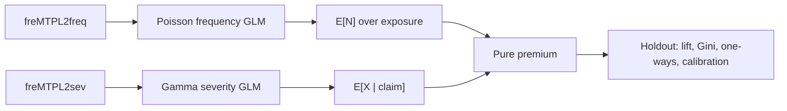
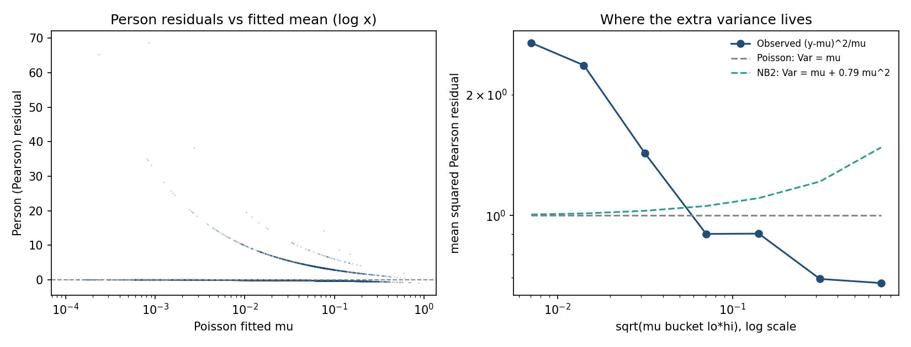
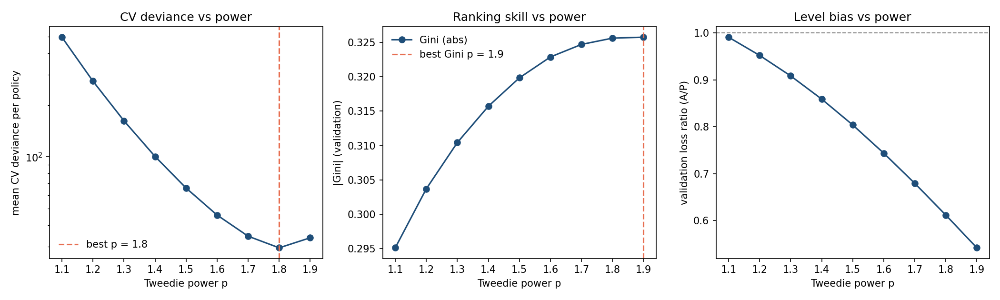
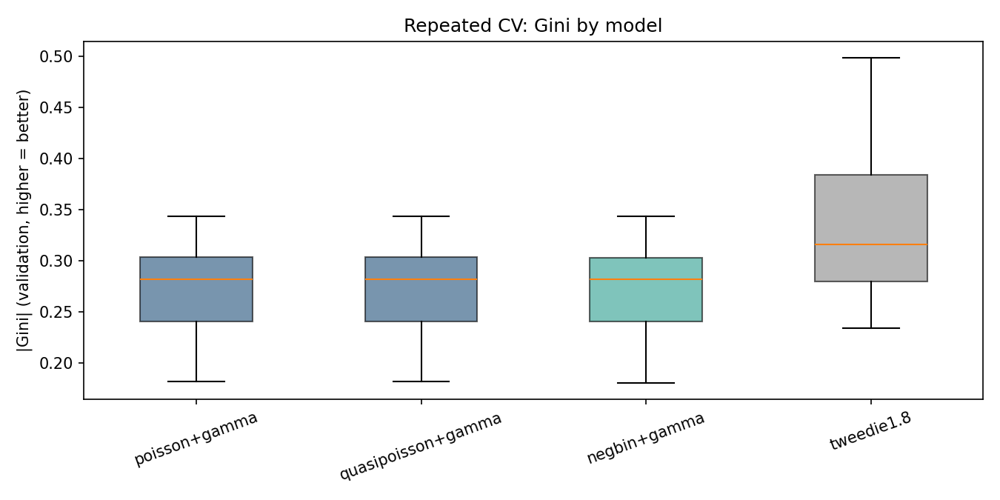
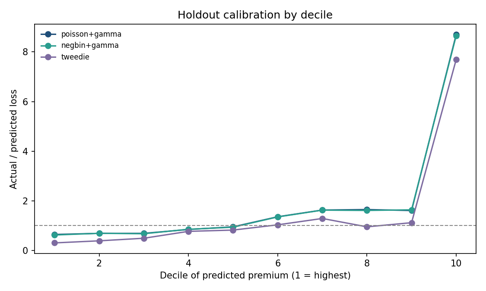
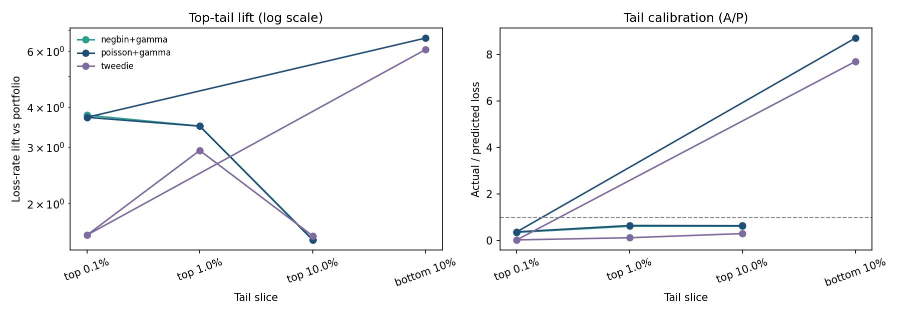
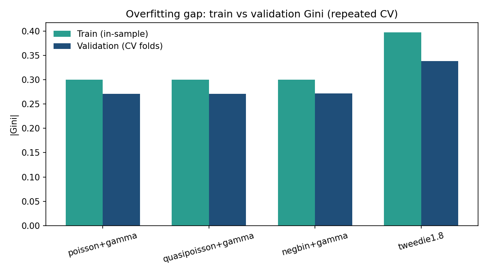

# Holdout analysis: frequency–severity GLM on freMTPL2

Plain-language version: [HOW-IT-WORKS.md](HOW-IT-WORKS.md).

This note is the analysis. `run.py` is the pipeline that produced it. The question is whether a two-part technical premium ranks French motor TPL losses on a holdout better than charging everyone the same rate per year of exposure.

It is not a market quote, a filing, or a model bake-off.

## Question

For each policy, estimate expected loss from the usual motor rating factors, then check on unseen policies:

1. Does the score put more **actual** loss among the high-score policies than an exposure-weighted flat rate?
2. Does that product of means look reasonable when sliced by factor and by predicted-premium band?

Expected loss is the product of two means, not a single Tweedie GLM:

$$
\text{pure premium} = E[N] \times E[X \mid \text{claim}]
$$

`pure_premium` is expected loss over the **observed** exposure. `annual_pure_premium` is that amount divided by exposure (loss per policy-year).

## Data and clean-up

French motor third-party liability, CASdatasets `freMTPL2freq` / `freMTPL2sev` (Dutang & Charpentier). Frequency is one row per policy; severity is one row per positive claim amount.

| | |
| --- | --- |
| Policies | 678,013 |
| Exposure years | 358,360 |
| `ClaimNb` sum (after cap) | 36,056 |
| Severity rows | 26,639 |
| Policies where `ClaimNb` ≠ severity row count | 9,125 |

On this file, frequency claim counts often do not match the number of severity rows for the same `IDpol`. Frequency still uses `ClaimNb`; severity uses observed amounts. They are not forced to match. Only 9 policies have a **both-positive** count mismatch; most mismatches are count vs zero on one side.

Standard caps for this dataset: `ClaimNb` at 4 (16 policies hit the cap), exposure at 1 year, claim size at the 99.5th percentile (€34,387; 134 claims clipped) so a handful of large losses do not dominate Gamma MLE.

The 80/20 split is stratified on `ClaimNb > 0` so the severity sample is not emptied by chance (542,410 / 135,603 policies; 21,132 train claims).

## Method

Both GLMs use the same formula: categorical bands for area, vehicle power, vehicle age, driver age, bonus-malus, brand, fuel, region, plus `log(Density)`.



- **Frequency** — Poisson, log link, offset `log(Exposure)`. Predicts expected claim **count** over the observed exposure, not an annualized rate.
- **Severity** — Gamma, log link, one row per claim with the policy’s rating factors attached.
- **Actual loss** for scoring is the sum of claim amounts on the policy (0 if none).
- **Benchmark** — same total holdout loss allocated by exposure only (flat rate per year).

Relativities are exp($\hat{\beta}$) versus the treatment reference (bonus-malus 50, driver age 18–20, vehicle age 0, area A, diesel, brand B1, Alsace).

## Holdout ranking

Test actual loss is **€11.06M**. The GLM books **€12.27M** of pure premium (loss ratio **0.90**). That gap is a level issue (severity cap, frequency/severity mismatch, no intercept recalibration). Ranking does not require the totals to match.

Gini here orders policies by **decreasing** score. A more negative value means more actual loss sits among the high-score policies.

| Ranker | Gini |
| --- | --- |
| Policy expected loss (`pure_premium`) | −0.251 |
| Annual pure premium | −0.155 |
| Exposure only (flat rate) | −0.168 |

The GLM ranks better than a flat rate **when the score is policy expected loss**. Ranking by annual premium is slightly **worse** than ranking by exposure. Exposure length is already a strong ranker of dollar loss: a policy in force for a full year has more time to produce a claim than a one-month policy with the same risk profile.


Decile 1 (highest predicted **policy** premium) has lift **1.54** and holds about **23%** of test loss on **15%** of test exposure. Deciles 2–5 sit below 1.0. The bottom decile is noisy (lift ~6.6 on 656 exposure years): short-duration policies collect there, and a few large claims inflate the empirical rate. That is a ranking artifact, not evidence that the cheapest 10% of the book is six times average.


When the same policies are ranked by **annual** premium, the top decile lift is **2.16**, but that slice is only **6%** of exposure (high rate, short duration). The two scores answer different questions: “who will generate the most dollars this term?” versus “who is expensive per year?”

## What drives the rate

Frequency carries it. Bonus-malus 101–150 has a frequency relativity of **5.64** versus 50; 81–100 is **2.57**. On the holdout, observed frequency moves from **0.08** claims per exposure year at bonus-malus 50 to **0.35** at 101–150, and the GLM tracks that. Severity relativities on the same bands stay near 1.0–1.14.

Young drivers (18–20) are the frequency base. Ages 21–40 are about **0.53–0.65** times that frequency. Severity is lower than the 18–20 base for every older band, but the steps are small compared with frequency.

Vehicle age 0 (new) is the frequency base; older bands sit around **0.26–0.32**. That is a large frequency effect, not a severity story.

Area, brand, region, and log density are mostly small or poorly determined, especially in severity (wide standard errors, few claims per cell).


One-way loss versus premium is not a perfect overlay. Bonus-malus 50 is slightly overpriced (loss ratio 0.85); 51–60 is slightly underpriced (1.12). Driver age 61–70 is overpriced (0.63); 71+ is underpriced (1.36), a thin, volatile slice.

## Calibration

Bucketed by predicted annual premium, actual loss per exposure year still rises with the model, but the top band is **overpriced** (model ~€609 per exposure year vs actual ~€334; loss ratio 0.55). The bottom band is **underpriced** (model ~€76 vs actual ~€101). The GLM separates cheap from expensive risks; it does not nail the dollar amount in the tails.


## Caveats

- Frequency and severity files are not claim-count consistent. Do not treat \(E[N] \times E[X]\) as a reconciled compound distribution.
- Severity is fit on capped amounts; holdout actual loss is **uncapped**. That pushes the booked premium and the observed loss apart, especially in the right tail.
- Vehicle power 16+ is effectively empty after banding and shows a degenerate coefficient. It should not be read as a relativity.
- No expenses, cost of capital, competition, or credibility. Recalibrating the intercept so holdout premium equals holdout loss would change the loss ratio, not the rank order.
- Numbers above are from one stratified split (`random_state=42`). Reproduce with `python run.py` after placing the CSVs (see the README).

---

# Part II — Model validation: overdispersion, quasi/NB corrections, and Tweedie

`run_extended.py` is the pipeline that produced this part (same 80/20 split, seed 42, same factors). Everything below is on the training split unless stated otherwise. This part is a model bake-off *within* the GLM family: does correcting the frequency variance, or modelling pure premium directly with Tweedie, change the price list or the ranking?

One implementation note: the fits use a fast custom IRLS (`src/fastirls.py`) because statsmodels' GLM takes ~50 s per fit on 542k rows and the validation program needs hundreds of fits. The custom solver matches statsmodels to ~1e-4 on coefficients and deviance for every family used here (Poisson, Gamma, Tweedie; NB2 α by profile MLE, LR test and AIC cross-checked).

## II.1 Is the Poisson frequency model properly dispersed?

The two textbook statistics disagree, and the disagreement is the story.

| Statistic | Value | Poisson-null reference |
| --- | --- | --- |
| Deviance ratio $D/(n-p)$ | **0.313** | 0.281 ± 0.001 (bootstrap) → z = +28.8 |
| Pearson ratio $X^2/(n-p)$ | **2.312** | 1.000 ± 0.013 (bootstrap) → z = +104.7 |
| Person (std. Pearson) residual variance | 2.31 | 1.0 |

The deviance ratio *looks* like under-dispersion if you compare it to 1.0. It is not. With 95% zeros and mean fitted $\mu \approx 0.05$, the unit deviance at $y=0$ is $2\mu$, so the deviance sum is dominated by how small the fitted means are — the statistic has no business sitting at 1.0 under the null on this data. A 200-rep parametric bootstrap (simulate `Poisson(μ̂)`, hold the model fixed) puts the null distribution at 0.281 with SD 0.001. The observed 0.313 is 29 standard deviations **above** that null — the same direction of violation as the Pearson statistic, just expressed on a different scale. Both statistics reject the Poisson variance assumption; the Pearson ratio is the interpretable one, and it says substantial **over**dispersion.

The bootstrap also settles a subtler question: on this data the Pearson ratio is well-calibrated (null mean 1.000, SD 0.013) while the deviance ratio is not. Report both, trust the Pearson ratio.

### Where the extra variance lives

Mean squared Person residual by fitted $\mu$ band:

| μ band | n | mean $(y-\hat\mu)^2/\hat\mu$ | Poisson predicts | NB2 (α=0.79) predicts |
| --- | --- | --- | --- | --- |
| [0, 0.02) | 150,567 | **5.51** | 1.0 | 1.007 |
| [0.02, 0.05) | 139,969 | **1.43** | 1.0 | 1.028 |
| [0.05, 0.1) | 196,676 | 0.90 | 1.0 | 1.056 |
| [0.1, 0.2) | 46,176 | 0.90 | 1.0 | 1.107 |
| [0.2, 1) | 9,011 | 0.69 | 1.0 | 1.234 |



The excess variance is **monotonically decreasing in μ**. That is the opposite of what NB2 does (variance grows in μ) and what quasi-Poisson does (constant inflation). Most of it comes from claims arriving on policies the model scored as near-certain zeros: the 3,471 policies with μ < 0.02 that nonetheless produced a claim contribute 828,056 of the 829,398 Pearson chi-square in that band.

### The mechanism: broken count data, not missing structure

The largest single source is the frequency/severity count mismatch documented in Part I. Policies with `ClaimNb > 0` but **zero rows in the severity file** — 7,309 of them in train, 1.35% of the book — contribute **44.6%** of the training Pearson chi-square (558,964 of 1,254,084). These are phantom claims: count data says a claim happened, the money says it did not (or was recorded under a different `IDpol`). They hold **26.9% of claim counts** but only **0.24% of actual loss**.

The rest is the genuine actuarial phenomenon: unmodelled heterogeneity concentrated at low μ — short-exposure policies (median exposure 0.08 years among low-μ claimants) and rating-factor combinations the model scores as safe but which occasionally produce claims anyway.

### Does the overdispersion meaningfully affect the data?

Three separate lenses, same answer: **the fit is fine, the inference is not.**

1. **Premiums / ranking.** NB2 shifts rating relativities by between −5.0% and +1.4% (largest move: vehicle-age bands, all in the same direction — NB2 pushes all older-vehicle relativities ~5% further from new cars). Top-decile overlap between Poisson and NB2 premium rankings on the holdout is **98.8%**; Spearman correlation 0.9999. The price list is effectively unchanged.
2. **Inference.** This is where it bites. The Poisson standard errors are too small by $\sqrt{2.31} = 1.52\times$. Quasi-Poisson (φ = 2.31) inflates them accordingly; three terms that were marginally significant under Poisson (DrivAge 41–50 at p=0.0008 → 0.028; 51–60 at 0.0000 → 0.0045; VehPower 8–9 at 0.0012 → 0.033) survive, but LogDensity flips from significant (p=0.046) to not (p=0.189) and Area/Brand/Region terms lose most of their marginal significance. NB2 (α = 0.79) gives similar but slightly tighter SEs than quasi-Poisson on most terms. **Any p-value from the raw Poisson on this data is fiction.**
3. **Prediction intervals / simulation.** If you simulate this book from the fitted Poisson (e.g. for capital or reinsurance pricing), total claim counts will be undersimulated in the tail — the model's implied count volatility is wrong at the policy level even though the mean is right.

## II.2 Quasi-Poisson vs NB2

| | Quasi-Poisson | NB2 |
| --- | --- | --- |
| Variance function | $\phi\mu$, φ = 2.312 (fixed by Pearson ratio) | $\mu + 0.791\mu^2$ (α by profile MLE) |
| Log-likelihood | — (quasi-likelihood only) | −112,458.8 vs Poisson −112,686.1 |
| LR test vs Poisson | — | 454.6 on 1 df, p = 7e-101 |
| AIC | — | 225,035.6 vs 225,488.2 (ΔAIC = 453, NB2 wins) |
| β̂ | identical to Poisson (same score equation) | shifts −5.0% to +1.4% in relativity |
| SEs | √φ = 1.52× Poisson SEs | between Poisson and quasi on most terms |

Both corrections are statistically justified and neither changes the model where it matters. NB2 is the better *model* of the data (real likelihood, dominant AIC, α stable at 0.75–0.83 across all 15 CV folds — a structural parameter, not noise). Quasi-Poisson is the better *correction for inference* on this particular dataset, for a specific reason: the overdispersion is decreasing in μ, so a constant inflation matches the low-μ band where the violation lives better than a quadratic that is calibrated to fit on average. Neither can capture the actual shape (excess at low μ, *under*dispersion at high μ); a proper fix would model the count mismatch or use cluster-robust standard errors.

The remaining overdispersion after NB2 is still concentrated at low μ (5.44 vs predicted 1.007 in the lowest band) — NB2 absorbs almost none of it, because its variance function has the wrong shape for this data. What NB2 does instead is *down-weight* the low-μ policies in the score equation relative to Poisson, which is why the vehicle-age relativities shift.

## II.3 Tweedie power selection

Grid over p ∈ {1.1, 1.2, …, 1.9}, 5-fold CV within the training split (stratified on claimant status), scored by mean Tweedie unit deviance on the validation folds:

| p | mean CV deviance | SD | mean val Gini (abs) | mean val loss ratio |
| --- | --- | --- | --- | --- |
| 1.1 | 496.1 | 203.0 | 0.295 | 0.991 |
| 1.2 | 275.5 | 88.7 | 0.304 | 0.952 |
| 1.3 | 162.0 | 40.8 | 0.310 | 0.909 |
| 1.4 | 100.6 | 19.6 | 0.316 | 0.859 |
| 1.5 | 65.9 | 9.8 | 0.320 | 0.804 |
| 1.6 | 45.9 | 5.0 | 0.323 | 0.744 |
| 1.7 | 34.6 | 2.7 | 0.325 | 0.679 |
| **1.8** | **29.6** | 1.6 | 0.326 | 0.612 |
| 1.9 | 33.9 | 1.0 | 0.326 | 0.542 |



- **Deviance picks p = 1.8** (the bowl bottoms out between 1.8 and 1.9; 1.9 turns back up).
- **Ranking skill is nearly flat in p**: |Gini| moves from 0.295 to 0.326 across the whole grid — a 10% range. The model's ability to *order* risks is insensitive to the variance assumption; what changes is the dollar level. (Deviance across p values is not on a common scale — the y-only term in the unit deviance changes with p — so the *shape* of the curve is informative, and within-p comparisons are exact, but the absolute deviance levels across p should not be compared to Poisson-family deviances.)
- **Level bias grows monotonically in p**: validation loss ratio falls from 0.99 at p=1.1 to 0.61 at p=1.8. The higher the power, the more the Tweedie score under-weights the (many, small) zero-loss policies relative to the (few, large) positive ones, and the more the fitted level drifts up. At p=1.8 the raw model over-predicts holdout loss by 85% (LR 0.54); after balancing the book to training loss (single multiplicative factor 0.592), holdout LR is 0.912.
- **Sensitivity verdict**: the *ranking* is robust (flat in p); the *level* is not (LR spans 0.54–0.99 across the grid). If you deploy a Tweedie at deviance-optimal p without balancing, you will book 60–85% more premium than the loss you will incur.

A caveat on the deviance comparison across p: for 1<p<2 the unit deviance contains a y-dependent term $y^{2-p}/((1-p)(2-p))$ that changes with p, so absolute deviance values are only comparable within a p (the fold-splitting and the prediction set are identical across the grid, so the *ranking of p by CV deviance* is still the standard power-selection procedure; it is the same convention scikit-learn's TweedieRegressor grid search uses).

## II.4 Repeated cross-validation: all four models head-to-head

3 repeats × 5 folds, stratified on claimant status, within the training split only (the holdout stays untouched until §II.5). Each fold refits everything from scratch: frequency model, severity model (with fold-specific 99.5% severity cap), Tweedie.

| Model | mean \|Gini\| (val) | SD | mean \|Gini\| (train) | mean val LR | mean train LR |
| --- | --- | --- | --- | --- | --- |
| poisson+gamma | 0.2712 | 0.0484 | 0.3000 | 1.001 | 1.000 |
| quasipoisson+gamma | 0.2712 | 0.0484 | 0.3000 | 1.001 | 1.000 |
| negbin+gamma | 0.2717 | 0.0496 | 0.3008 | 0.988 | 0.986 |
| tweedie 1.8 | **0.3384** | 0.0872 | 0.3979 | 0.606 | 0.595 |



Notes on reading this table:

- **Quasi-Poisson = Poisson on every prediction.** Its φ only rescales the covariance; the fitted means are identical by construction. It is listed to make that explicit, not as an independent candidate.
- **The frequency–severity family is a statistical dead heat.** NB2 vs Poisson paired Gini difference: mean −0.0004, p = 0.57 (paired t-test across 15 folds). The variance correction does not change what the model *sees*, only how confident it claims to be.
- **Tweedie separates risk better and the gap is real.** Paired fold-by-fold: Tweedie beats Poisson on 14 of 15 folds; mean Gini difference −0.067, paired t-test p = 8.4e-04 (Wilcoxon p = 1.2e-04). This is not a sampling fluke.
- **Fold Gini SDs are large for everyone (0.05–0.09)** because each validation fold is only ~6,800 claimant policies and Gini on dollar loss is a heavy-tailed statistic. This is exactly why the repeated-CV design (and the paired tests above) matters: a single 80/20 split would not reliably separate these models. The holdout Gini (§II.5) sits at the pessimistic end of the CV distribution for every model — including the exposure benchmark (CV mean −0.099 vs holdout −0.168): this particular holdout draw has loss more concentrated on long-exposure policies than the average training fold, which flatters all scores that correlate with exposure.
- **The Tweedie level bias is structural, visible in every fold** (val LR 0.61 vs train LR 0.60 — consistent, not overfitting; see §II.6).

## II.5 Holdout evaluation

Refit on the full training split, evaluated once on the untouched 20% holdout. Paired bootstrap (200 resamples of holdout policies) for Gini differences:

| Ranker | Gini | 95% CI (vs Poisson) | Loss ratio | Top-10% loss share |
| --- | --- | --- | --- | --- |
| Exposure only | −0.168 | — | — | — |
| poisson+gamma | −0.2506 | — | 0.903 | 22.7% |
| quasipoisson+gamma | −0.2506 | (identical score) | 0.903 | 22.7% |
| negbin+gamma | −0.2494 | Δ = +0.0011 [−0.0005, +0.0017], p = 0.0007 | 0.891 | 22.6% |
| tweedie 1.8 | **−0.2772** | Δ = −0.0306 [−0.0767, +0.0121], p = 0.18 | 0.540 raw | 24.3% |
| tweedie 1.8 (balanced) | −0.2772 | (same score) | **0.912** | 24.3% |

Read the two bootstrap intervals carefully, because they look contradictory and are not:

- **NB2 vs Poisson on the holdout**: the Gini difference (+0.0011, *worse*) is 3.4 bootstrap SDs from zero — statistically detectable and practically irrelevant. Tiny and consistent: NB2 marginally reshuffles the middle of the ranking without changing the price list.
- **Tweedie vs Poisson on the holdout**: the point estimate (−0.031, *better*) is not statistically significant on this single split (CI spans zero) even though CV says the effect is real (14/15 folds, p = 8e-04). Single-split holdout evidence for a Gini difference this size (0.03 on a heavy-tailed dollar-loss statistic, 135k policies) is underpowered; the CV evidence is the more reliable guide. This is a general lesson: **do not ask one 20% holdout to adjudicate a 3-point Gini gap.**

### Stability

- α (NB2) across 15 CV folds: 0.750–0.834, SD 0.024. φ (quasi) across folds: 2.28–2.38, SD 0.037. Both are structural, not noise.
- Relativities across models: Spearman 0.9999 (Poisson vs NB2 premium ranking); 98.8% top-decile overlap. The frequency–severity family is one model in three costumes.
- Tweedie vs Poisson: Spearman 0.835, top-decile overlap 52.7%, top-1% overlap 22.5%. Genuinely different ranking.

### Calibration by decile (holdout)



| Decile (by own premium, desc.) | poisson A/P | negbin A/P | tweedie A/P |
| --- | --- | --- | --- |
| 1 (highest) | 0.64 | 0.62 | 0.30 |
| 2 | 0.68 | 0.67 | 0.38 |
| 3 | 0.68 | 0.67 | 0.49 |
| 4 | 0.84 | 0.82 | 0.76 |
| 5 | 0.95 | 0.93 | 0.82 |
| 6 | 1.35 | 1.33 | 1.03 |
| 7 | 1.62 | 1.59 | 1.28 |
| 8 | 1.64 | 1.61 | 0.95 |
| 9 | 1.60 | 1.58 | 1.11 |
| 10 (lowest) | 8.70 | 8.36 | 7.69 |

All three models share the same failure shape: **over-predict the top, under-predict the bottom** — the classic GLM compression of a heavy-tailed target. Both frequency–severity models over-price their top decile by ~55% (A/P 0.64) and under-price the bottom decile by 8.7×. The Tweedie's top-decile A/P of 0.30 is *worse* level bias, but note its bottom decile A/P (7.69) is slightly better than the freq-sev models'.

The bottom-decile A/P of ~8–9 is dominated by short-exposure policies where a handful of large claims land (656 exposure years in the holdout bottom decile). It is a volatility artifact of the *score*, not evidence the cheapest decile is 8× more expensive than priced — with ~650 exposure-years, one €100k claim moves that cell by ~150 loss ratio points.

### Tails: do the models predict different things?



| Model | top 10% | top 1% | top 0.1% | bottom 10% |
| --- | --- | --- | --- | --- |
| poisson+gamma | lift 1.54, A/P 0.64 | lift 3.50, A/P 0.65 | lift 3.73, A/P **0.37** | lift 6.59, A/P 8.70 |
| negbin+gamma | lift 1.55, A/P 0.62 | lift 3.50, A/P 0.62 | lift 3.78, A/P **0.35** | lift 6.07, A/P 8.36 |
| tweedie 1.8 | lift **1.59**, A/P 0.30 | lift 2.93, A/P 0.12 | lift 1.60, A/P **0.03** | lift 6.07, A/P 7.69 |

- **Through the top 10%, Tweedie is the better ranker** (captures 24.3% of holdout loss vs 22.7%). Its top-decile lift 1.59 also edges out Poisson's 1.54.
- **At the extreme tip (top 0.1%), the frequency–severity model is clearly better**: it captures 5.5% of holdout loss there vs Tweedie's 2.5%, and is far better calibrated (A/P 0.37 vs 0.03 — Tweedie over-predicts the extreme tail 30× over). The Tweedie's flatter severity treatment — it never sees claim-level structure, only policy totals — hurts exactly where the money is.
- **Tweedie prices the tail higher**: by its own deciles, Tweedie's premium exceeds the freq-sev premium by 1.53–1.78× in every decile, but the ratio is *highest* at the very top (1.78 in decile 1). Combined with its top-tail over-prediction, the Tweedie's top decile is priced roughly 2.4× the level the frequency–severity model would charge there (0.30 A/P vs 0.64).

Who ends up in Tweedie's top decile but not Poisson's (6,420 policies each way)? The Tweedie-only group is **younger (mean age 38 vs 48), higher bonus-malus (71 vs 64), longer-exposure (0.74 vs 0.68 years)**, and captured 6.97% of holdout loss vs 5.43% for the Poisson-only group. The Tweedie's ranking is not just differently scaled — it is putting a genuinely different (and on this holdout, more loss-rich) set of risks at the top.

## II.6 Overfitting: train vs validation



| Model | train \|Gini\| | val \|Gini\| | gap | train LR | val LR |
| --- | --- | --- | --- | --- | --- |
| poisson+gamma | 0.3000 | 0.2712 | 0.029 | 1.000 | 1.001 |
| negbin+gamma | 0.3008 | 0.2717 | 0.029 | 0.986 | 0.988 |
| tweedie 1.8 | 0.3979 | 0.3384 | 0.060 | 0.595 | 0.606 |

- Gini gap (train − val): 0.029 for freq-sev, 0.060 for Tweedie — a consistent ~10% and ~15% relative shrinkage, i.e. ordinary optimism, not overfitting. A 57-parameter GLM on 542k policies has no room to memorize.
- The Tweedie's larger *relative* gap matches its larger variance: it fits the extremes harder (weights μ^(1-p) concentrate on small-μ observations), so it has both more signal and more fold-to-fold spread.
- Loss ratios barely move between train and validation folds for any model — including Tweedie's 0.60. **The Tweedie level bias is structural (a property of deviance-optimal p on this target), not a generalization failure.** Its train LR (0.595) equals its validation LR (0.606): the model is exactly as over-priced in-sample as out-of-sample.

## II.7 Conclusions and what we would do next

1. **Keep frequency–severity as the production structure.** Transparent, interpretable relativities, and the variance corrections (quasi/NB2) are cosmetic for pricing. Its tail behavior (top 0.1%) is materially better than Tweedie's.
2. **Stop reporting raw Poisson standard errors.** φ = 2.31 makes every Wald test over-confident by 1.52×. Use quasi-Poisson SEs, NB2, or a bootstrap for any inference on relativities. LogDensity's "significance" does not survive the correction; BonusMalus, DrivAge, VehAge, VehPower bands, and VehGas do (comfortably).
3. **The count mismatch is the first thing to fix in the data, not the model.** 7,309 phantom claims drive 44.6% of the Pearson chi-square. A reconcile-the-counts pass (either drop them, or fix the join on `IDpol`) would change the dispersion picture more than any variance-function choice. This is a data-engineering task the model cannot do for you.
4. **Use Tweedie as a challenger, not the primary.** It ranks better (Gini −0.277 vs −0.251 holdout; 14/15 CV folds) and its top-decile lift is slightly higher, but it over-predicts the top tail 3–30× and under-captures the extreme tip. If deployed: balance the book (recalibrate the level, factor 0.59 at p=1.8) and cap its discretion in the top decile.
5. **If the goal is the tail specifically, neither family is enough.** The top 0.1% is where both models over-predict; the frequency–severity model is merely 2.7× over rather than 30×. A severity distribution with a heavier tail (lognormal, Pareto), or a GB2/hybrid, is the natural next step. Also worth testing: `VehPower` and `DrivAge` as continuous smooths rather than bands — the bands are the model's main remaining structure constraint.
6. **Power selection should not be deviance-alone.** The deviance bowl (29.6 at 1.8 vs 34.6 at 1.7 and 33.9 at 1.9) is shallow, ranking is flat in p, and level bias is steep in p. A production power selection would add a level constraint (balanced book) or a business metric to the objective. p=1.8 by deviance; p≈1.5 by "level bias under 20%"; the choice is a business decision, not a statistical one.

## II.8 Reproducing

```bash
.venv/bin/python run_extended.py      # ~4 min on M3 Ultra: diagnostics, grid, CV, holdout
.venv/bin/python run_charts.py        # charts into outputs_extended/
```

Outputs: `outputs_extended/task1_diagnostics.json`, `task1_relativities.csv`, `task2_summary.csv`, `task2_grid_folds.csv`, `task3_cv_folds.csv`, `task3_summary.csv`, `holdout_summary.json`, `holdout_calibration_*.csv`, `holdout_tails.csv`, `holdout_relativities.csv`, `holdout_tweedie_vs_fs_deciles.csv`, and the PNGs referenced above.

Caveats specific to Part II: the CV folds are stratified on claimant status but the Gini statistic is computed on dollar loss, so fold-to-fold Gini spread (SD 0.05–0.09) reflects heavy-tailed sampling, not model instability. The Tweedie is fit on policy-level pure premium (actual loss) with a log-exposure offset, uncapped on the training side; the frequency–severity models use the 99.5% severity cap — that asymmetry slightly flatters the frequency–severity models' *level* metrics (their premium is capped, Tweedie's target isn't) but does not affect Gini or A/P ratios within the top deciles.

