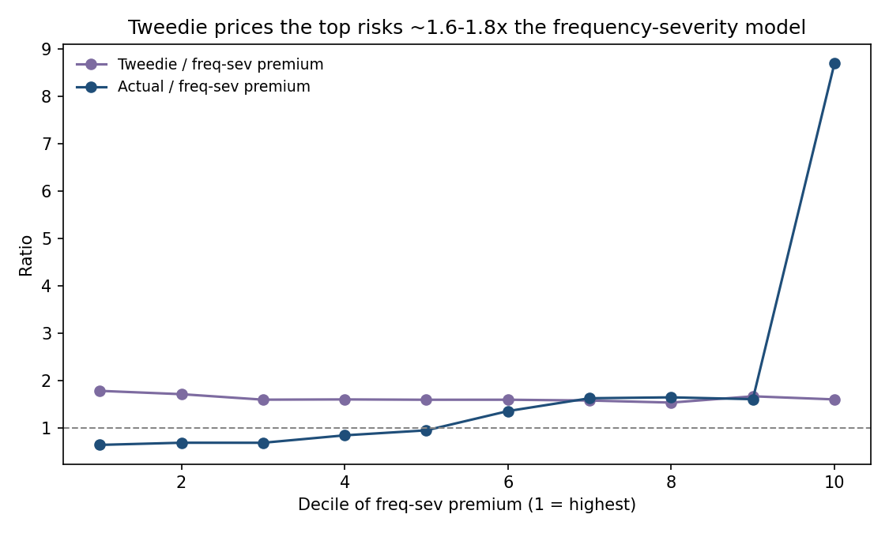

# Frequency–severity GLM pricing (freMTPL2)

Technical motor TPL premium on the French CASdatasets `freMTPL2` files: a Poisson frequency GLM, a Gamma severity GLM, and pure premium $E[N] \times E[X \mid \text{claim}]$, scored on a holdout against an exposure-weighted flat rate.

This is a complete baseline, not a rating engine.

- **Not an actuary?** Start with [HOW-IT-WORKS.md](HOW-IT-WORKS.md).
- **Technical note:** [ANALYSIS.md](ANALYSIS.md).

## Results (20% holdout)

Ranking by policy expected loss concentrates actual loss better than a flat rate. Gini is **−0.251** vs **−0.168** when ranking by exposure only (more negative is better here: policies are ordered high score first). Top-decile lift is **1.54**.

Loss ratio is 0.90 on the holdout this reflects the severity cap and a known frequency/severity count mismatch in the source data (see [ANALYSIS.md](ANALYSIS.md#caveats)), not model miscalibration; ranking performance is unaffected.


| | |
| --- | --- |
| Train / test policies | 542,410 / 135,603 |
| Train claims (severity fit) | 21,132 |
| Test actual loss | 11.06M |
| Test model premium | 12.27M |
| Loss ratio | 0.90 |

Frequency (bonus-malus, driver age) carries most of the rate. Severity factors are mostly weak. Ranking by **annual** premium looks worse because policy expected loss mixes exposure length with risk.

## Model validation and extension (September 2026)

The baseline was re-tested against overdispersion corrections and a Tweedie alternative. Full detail in [ANALYSIS.md](ANALYSIS.md); the headline findings:

1. **The Poisson frequency model is overdispersed, but the usual statistics disagree.** The Pearson chi-square ratio is **2.31** (over-dispersed); the deviance ratio is **0.31** (looks under-dispersed). On this data — 95% zeros, mean fitted $\mu \approx 0.05$ — the deviance ratio is a broken yardstick: a parametric bootstrap under the Poisson null puts it at **0.281 ± 0.001**, not 1.0. Against its own null distribution the deviance ratio also rejects (z = +29), as does the Pearson ratio (z = +105). Overdispersion is real.
2. **It is concentrated where the count data is broken.** Policies with `ClaimNb > 0` but no rows in the severity file — 1.35% of the training book — contribute **44.6%** of the Pearson chi-square. They hold 26.9% of claim counts but 0.24% of actual loss. The over-dispersion decreases with fitted μ, which neither quasi-Poisson (constant inflation) nor NB2 (variance increasing in μ) is built to absorb.
3. **Corrections barely move the price list.** NB2 (α = 0.79, decisively better than Poisson by likelihood: LR = 455 on 1 df) shifts rating relativities by −5.0% to +1.4% at most; top-decile overlap with the Poisson model is 98.8%. Quasi-Poisson (φ = 2.31) inflates standard errors by √2.31 ≈ 1.52; three marginally significant terms drop out at 5%. **Inference from the plain Poisson is too optimistic; ranking and premiums are not meaningfully affected.**
4. **Tweedie prices differently where it matters.** A power grid 1.1–1.9 by 5-fold CV picks **p = 1.8** on deviance, but the deviance bowl is shallow (1.7 → 34.6, 1.8 → 29.6, 1.9 → 33.9) and ranking skill is almost flat in p. What is *not* flat is the level: validation loss ratio falls from 0.99 (p=1.1) to 0.61 (p=1.8). The raw p=1.8 model over-predicts the holdout by 85% (LR 0.54); after balancing to the training loss it lands at 0.91.
5. **Tweedie separates risks better, and differently.** Holdout Gini **−0.277** vs **−0.251** for the frequency–severity model (exposure benchmark −0.168). Repeated 5-fold CV (3 repeats) confirms: Tweedie wins the paired comparison on 14 of 15 folds, paired t-test p = 8e-04. But it ranks a *different* book: only 52.7% top-decile overlap with the Poisson model, 22.5% at the top 1%. Tweedie pushes young, high bonus-malus, long-exposure policies up and prices the top decile ~1.6–1.8× the frequency–severity model.
6. **The tails are where the two models genuinely disagree.** In the top 0.1% of risk, the frequency–severity model captures 5.5% of holdout loss vs Tweedie's 2.5% (both over-predict there). Tweedie is better through the top 10% (24.3% of loss vs 22.7%) but misses the extreme tip. Neither model is calibrated in the bottom decile (A/P ≈ 8), which is dominated by short-duration policies and a few large claims — a ranking artifact, not a pricing signal.
7. **No overfitting red flag.** Train-vs-validation Gini gap is 0.03 (freq–sev) and 0.06 (Tweedie) with a consistent ratio; CV deviance gap is ~4%.

**Bottom line:** keep the frequency–severity structure for the rate book — it is transparent, its corrections are cosmetic, and its tail is where the actual money is. Use quasi-Poisson or NB2 (or a bootstrap) for standard errors, never the raw Poisson covariance. Use Tweedie as a challenger model and a sanity check on the middle of the distribution: it ranks better overall but over-predicts the top tail and under-prices the extreme tip, and it will disagree with the Poisson about *which* specific risks are worst.

| Model (holdout) | Gini | Loss ratio | Top-decile loss share |
| --- | --- | --- | --- |
| Exposure only | −0.168 | — | — |
| Poisson + Gamma | −0.251 | 0.903 | 22.7% |
| NB2 + Gamma | −0.249 | 0.891 | 22.6% |
| Tweedie (p=1.8) | −0.277 | 0.540 raw / 0.912 balanced | 24.3% |



## Specification

- **Frequency** — Poisson GLM, log link, `offset = log(Exposure)`. `ClaimNb` capped at 4.
- **Severity** — Gamma GLM, log link, claim amounts capped at the 0.995 quantile.
- **Split** — 80/20, stratified on `ClaimNb > 0`.
- **Factors** — area, grouped vehicle power/age, driver age, bonus-malus, brand, fuel, region, log density.
- **Extension models** (`run_extended.py`) — quasi-Poisson (φ = Pearson ratio), NB2 (α by profile MLE), Tweedie GLM on policy pure premium with log-exposure offset, power by 5-fold CV grid over 1.1–1.9.

## Run

The first run downloads `freMTPL2freq.csv` (~38 MB) and `freMTPL2sev.csv` from a Hugging Face mirror into `data/raw/` if they are missing (or copies them from `Downloads` if you already have them). Later runs reuse the local files. CSVs are not in this repo (Dutang & Charpentier, CASdatasets). Needs a network connection once.

```bash
python -m venv .venv
.venv/Scripts/python -m pip install -r requirements.txt   # Windows
.venv/bin/python -m pip install -r requirements.txt       # macOS / Linux
.venv/Scripts/python run.py                               # Windows
.venv/bin/python run.py
```

The validation program is a separate entry point (same split, same factors, ~4 minutes on an M3 Ultra):

```bash
.venv/bin/python run_extended.py    # diagnostics, Tweedie grid, repeated CV, holdout eval
.venv/bin/python run_charts.py      # charts for outputs_extended/
```

Use the venv interpreter. Charts and tables land in `outputs/` and `outputs_extended/`.
